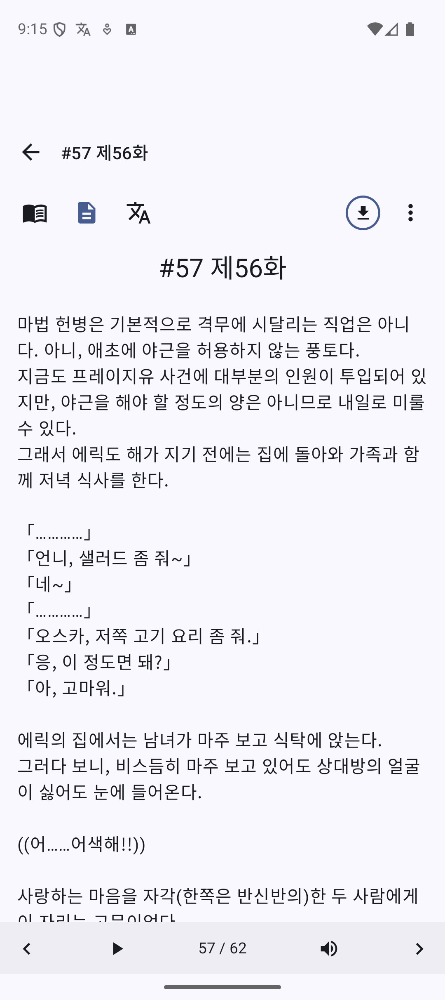
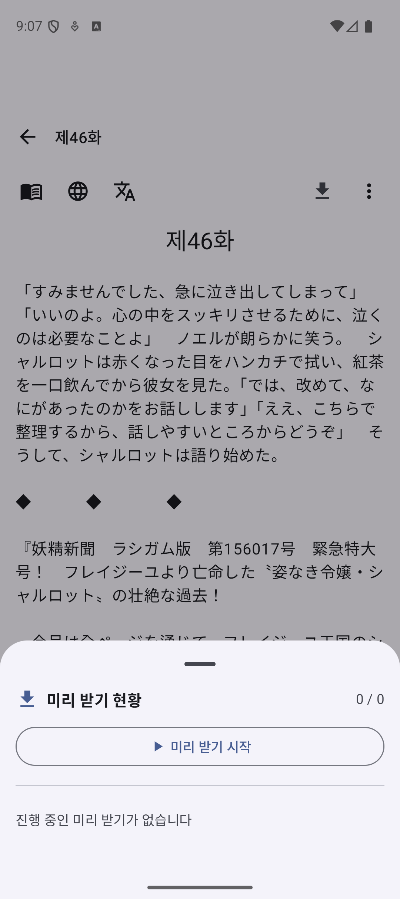
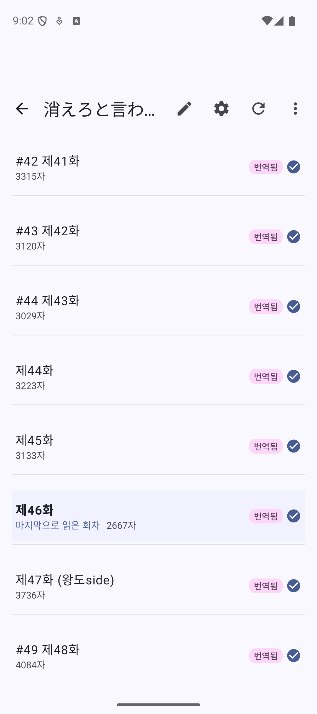

# 미리 받기 (Prefetch)

다음 회차를 미리 준비하여 끊김 없이 읽을 수 있는 기능입니다.

---

## 미리 받기란?

현재 회차를 읽는 동안 백그라운드에서:
- 다음 회차 원문 다운로드
- 다음 회차 번역 실행
- (선택) TTS 오디오 생성

> **참고**: 뷰어에서 시작하는 백그라운드 번역도 모두 미리 받기로 통합되었습니다.

---

## 장점

| 장점 | 설명 |
|------|------|
| **끊김 없는 읽기** | 회차 전환 시 대기 시간 없음 |
| **데이터 효율** | 읽을 가능성이 높은 회차만 미리 준비 |
| **배터리 절약** | 유휴 시간에 처리 |

---

## 설정 방법

### 미리 받기 활성화

1. 설정 열기
2. 성능 섹션으로 이동
3. "미리 받을 회차 수" 설정

### 미리 받을 회차 수

| 값 | 설명 |
|------|------|
| 0 | 미리 받기 비활성화 (안내 메시지 표시) |
| 1~3 | 권장 설정 |
| 4~10 | 많은 회차 미리 준비 |

> **추천**: 3회차 (기본값)
> **0으로 설정 시**: 미리 받기가 비활성화되며, 뷰어에서 안내 메시지가 표시됩니다.

---

## 번역과 함께 미리 받기

### 옵션 설명

- **OFF**: 원문만 다운로드
- **ON**: 다운로드 + 번역까지 실행

### 권장 설정

| 상황 | 권장 |
|------|------|
| 데이터 절약 필요 | OFF |
| 빠른 읽기 원함 | ON |
| 무제한 요금제 | ON |

---

## 미리 받기 상태 확인

### 뷰어에서 확인

뷰어 상단 바에 프리패치 아이콘이 항상 표시됩니다:
- 프리패치 활성화/비활성화 무관하게 항상 보임
- 아이콘을 탭하면 프리패치 상태 시트가 열림
- 상태 시트에서 수동으로 프리패치 시작/취소 가능

{: width="300" }

아이콘을 탭하면 아래와 같은 상태 시트가 표시됩니다:

{: width="300" }

### 회차별 상태 표시

| 상태 | 의미 |
|------|------|
| PENDING | 대기 중 (프리패치 예정) |
| DOWNLOADING | 원문 다운로드 중 (~20%) |
| SPLIT | 긴 회차를 분할 중 (분할 설정 활성화 시) |
| TRANSLATING | 번역 처리 중 (~60%) |
| COMPLETED | 준비 완료 (TTS 캐싱 포함 시 ~20%) |
| SKIPPED | 이미 번역된 회차 (건너뜀) |
| FAILED | 처리 실패 (재시도 필요) |

> **참고**: SPLIT 상태는 소설 설정에서 "회차 분할"을 활성화한 경우에만 표시됩니다. 분할 진행 중에는 "분할됨 (N/M 완료)" 형태로 진행률이 표시됩니다.

### 진행 상태 정보

프리패치 상태 시트에서 다음 정보를 실시간으로 확인할 수 있습니다:
- 전체 진행률 (백분율)
- 회차별 진행률 (다운로드/번역/TTS 단계별)
- 번역 중 스트리밍 토큰 수
- 경과 시간
- 현재 처리 중인 회차 정보

---

## TTS 프리캐시

Gemini TTS를 사용하는 경우, 오디오도 미리 생성할 수 있습니다.

### 설정

소설별 설정에서 TTS 프리캐시 옵션 활성화

### 동작

1. 회차 다운로드 (20%)
2. 번역 실행 (60%)
3. TTS 오디오 생성 및 캐시 (20%)

> **참고**: TTS 프리캐시는 API 비용이 추가로 발생합니다.

---

## 프리패치 완료 알림

프리패치가 완료되면 시스템 알림을 받을 수 있습니다.

### 완료 알림 기능

- 프리패치가 모두 완료되면 시스템 알림 표시
- 알림을 탭하면 해당 소설의 회차 목록으로 이동
- 뷰어에서 직접 읽기 시작 가능

### 실시간 배지 업데이트

- 회차 목록에서 번역 완료된 회차에 배지가 실시간으로 표시
- 프리패치 진행 중에도 완료된 회차는 즉시 확인 가능

{: width="300" }

---

## 리소스 사용

### 네트워크

- 다음 N개 회차의 원문 다운로드
- 번역 API 호출 (옵션)
- TTS API 호출 (옵션)

### 저장 공간

- 원문 텍스트 저장
- 번역 결과 저장
- 오디오 캐시 (TTS 사용 시)

### 배터리

- 백그라운드 처리로 배터리 소모
- 프리패치 수가 많을수록 소모 증가

---

## 효율적인 사용

### 권장 설정 조합

| 사용 패턴 | 프리패치 수 | 번역 포함 | TTS 캐시 |
|----------|------------|----------|---------|
| 가끔 읽기 | 1 | OFF | OFF |
| 일반 읽기 | 3 | ON | OFF |
| 집중 읽기 | 5 | ON | OFF |
| TTS로 듣기 | 3 | ON | ON |

### 데이터 절약 모드

- 프리패치 수: 1
- 번역 포함: OFF
- Wi-Fi에서만 프리패치 (시스템 설정)

### 프리패치 수동 제어

뷰어에서 프리패치를 수동으로 제어할 수 있습니다:
- **시작**: 프리패치 아이콘을 탭하고 시작 버튼 클릭
- **취소**: 프리패치 진행 중 취소 버튼 클릭
- **피드백**: 시작/취소 시 Snackbar로 상태 피드백 제공

---

## 배터리 최적화 해제 권장

백그라운드 번역의 안정성을 위해 배터리 최적화를 해제하는 것을 권장합니다.

### 설정 방법

1. 기기 설정 > 앱 > TransyV2 > 배터리
2. "배터리 최적화" 또는 "백그라운드 사용 제한"을 해제

### 왜 필요한가요?

Android의 배터리 최적화 기능이 백그라운드에서 실행 중인 번역 작업을 강제로 중단할 수 있습니다. 특히 장시간 프리패치를 실행하는 경우, 배터리 최적화 해제를 권장합니다.

> **참고**: 앱에서 백그라운드 번역 시작 시 배터리 최적화 해제를 안내하는 메시지가 표시될 수 있습니다.

---

## 주의사항

### API 비용

- 프리패치도 API 호출에 포함
- 읽지 않은 회차도 비용 발생
- 적절한 프리패치 수 설정 권장

### 저장 공간

- 많은 회차를 프리패치하면 저장 공간 증가
- 필요시 캐시 정리

### 연재 소설

- 마지막 회차 도달 시 프리패치 중단
- 새 회차 추가 후 자동 재개

---

## 문제 해결

### 미리 받기가 작동 안 함

**확인 사항**:
1. 프리패치 수가 0이 아닌지 확인 (0이면 비활성화 안내 메시지 표시)
2. 네트워크 연결 확인
3. API 키 유효성 확인
4. 뷰어 하단의 프리패치 아이콘을 탭하여 상태 확인

### 프리패치가 느림

**해결**:
1. 네트워크 상태 확인
2. 번역 포함 옵션 끄기
3. 프리패치 수 줄이기
4. 프리패치 상태 시트에서 진행 상황 및 경과 시간 확인

### 저장 공간 부족

**해결**:
1. 프리패치 수 줄이기
2. 읽은 소설의 캐시 삭제
3. TTS 캐시 정리

### FAILED 상태가 표시됨

**해결**:
1. 네트워크 연결 확인
2. API 키 유효성 확인
3. 프리패치 취소 후 다시 시작
4. 실패한 회차는 자동으로 재시도됨

---

## 다음 회차 자동 이동

읽기가 끝나면 자동으로 다음 회차로 이동하는 설정:

### 설정

설정 > 성능 > "자동 넘김"

### 동작

1. 현재 회차 끝까지 스크롤
2. 다음 회차가 준비되었으면 자동 전환
3. 스무스하게 다음 내용 표시

---

[← 번역 기능](translation.md) | [다음: 디스플레이 설정 →](display-settings.md)
