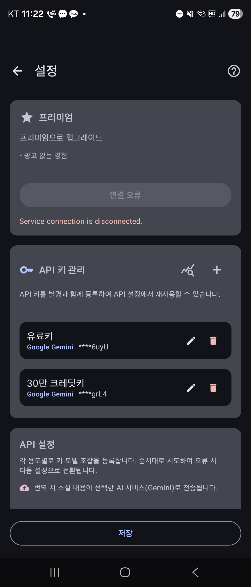
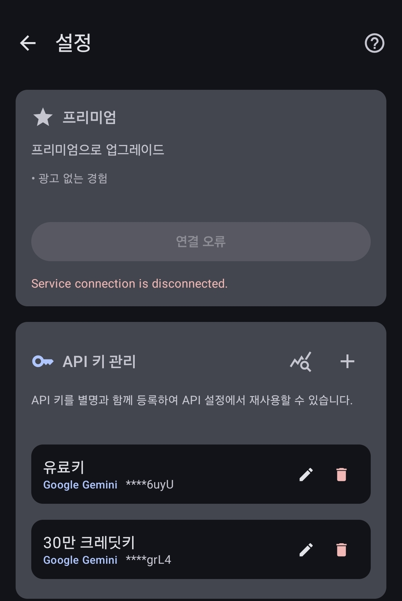
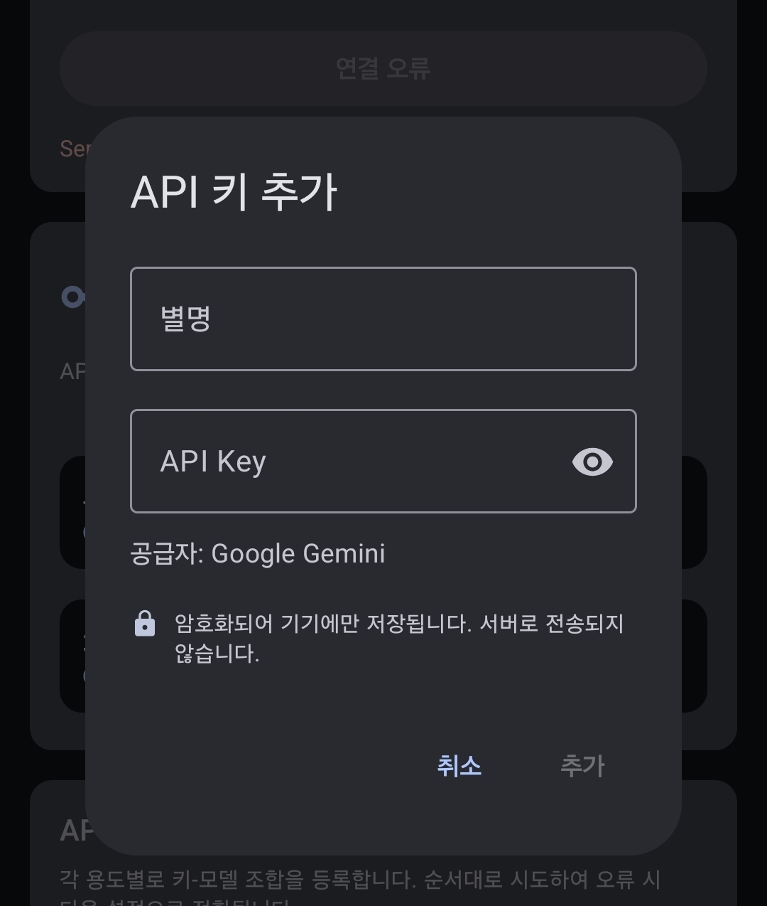
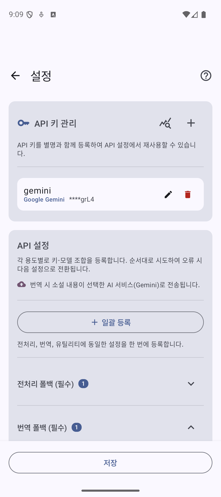
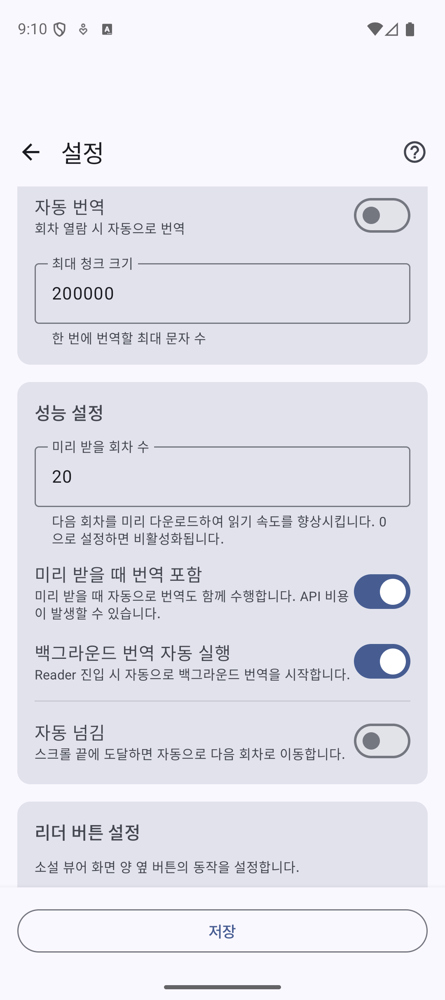

# Step 1. API 키 설정하기

Transy가 소설을 번역하려면 AI의 도움이 필요해요.
Google의 **Gemini API**를 사용할 거예요. 무료로 시작할 수 있으니 걱정 마세요!

---

## 1-1. API 키 발급받기

먼저 Google에서 API 키를 발급받아야 해요.

아래 링크에서 상세한 발급 방법을 확인할 수 있어요:
- [Gemini API 키 발급 방법 (클리앙)](https://www.clien.net/service/board/use/19096819)

> **팁**: 처음 사용하면 무료 크레딧이 제공돼요. 더 많은 크레딧이 필요하다면 [유료 크레딧 받는 법](https://cacommence.tistory.com/entry/Gemini-API-300%EB%8B%AC%EB%9F%AC-%ED%81%AC%EB%A0%88%EB%94%A7-%EB%B0%9B%EA%B8%B0-%ED%99%9C%EC%9A%A9%EB%B2%95-API-%ED%98%B8%EC%B6%9C-%EC%98%88%EC%A0%9C)을 참고하세요.

---

## 1-2. API 관리 화면 들어가기

API 키를 발급받았다면, 이제 앱에 등록해볼게요.

앱 하단의 **설정** 탭을 누르고, **API 관리** 메뉴를 찾아주세요.

---

## 1-3. 새 API 키 추가하기

API 관리 화면에서 오른쪽 아래의 **+ 버튼**을 눌러주세요.

---

## 1-4. API 키 등록하기

발급받은 API 키를 입력하고 저장해주세요.

- **API 이름**: 알아보기 쉬운 이름을 지어주세요 (예: "내 Gemini 키")
- **API 키**: 발급받은 키를 붙여넣기 하세요

---

## 1-5. API 조합 설정하기

등록한 키로 어떤 모델을 사용할지 설정해요.

> **추천**: 모델은 **Gemini 2.5 Flash**를 선택하세요. 빠르고 품질도 좋아요!

---

## 1-6. 번역 설정하기

마지막으로 번역 관련 설정을 해볼게요.

- **미리 받을 회차 수**: 몇 회차를 미리 번역해둘지 설정해요
  - 설정한 회차 수만큼 자동으로 미리 번역해둬요
  - 소설 뷰어에서 다음 회차로 넘어갈 때마다 자동으로 다음 회차가 미리 번역돼요

> **추천**: 3~5회차 정도로 설정하면 끊김 없이 읽을 수 있어요!

---

API 설정이 끝났어요! 이제 소설을 가져와볼까요?

[다음: 파싱 룰 만들기 →](../parsing-rule/)
