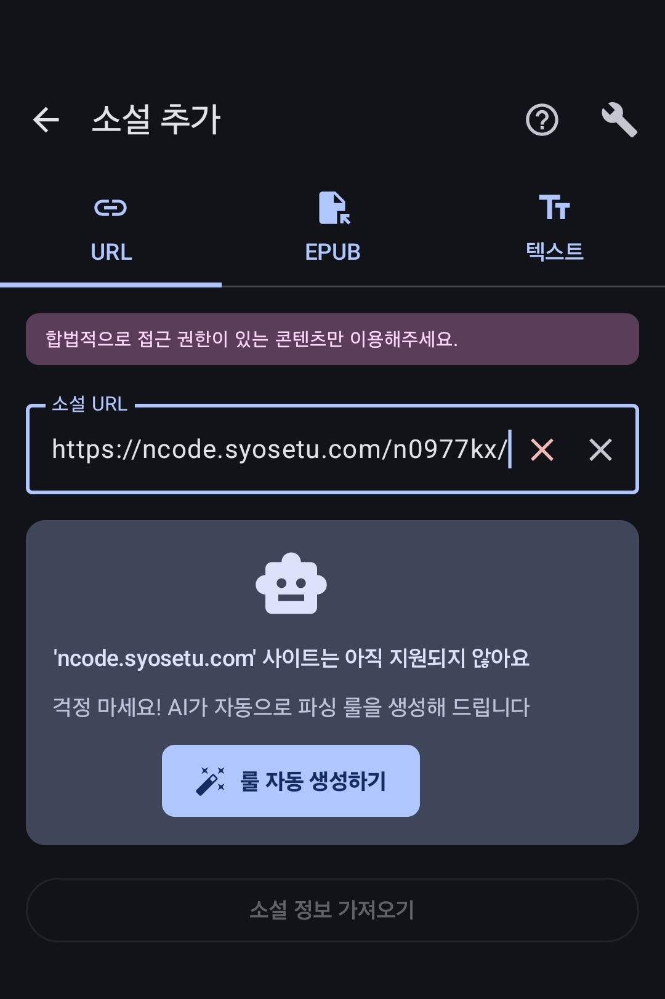
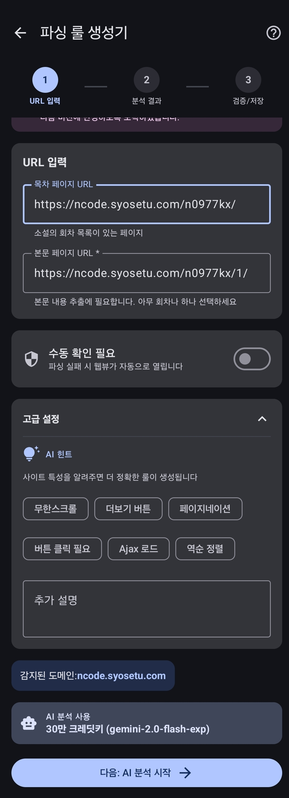
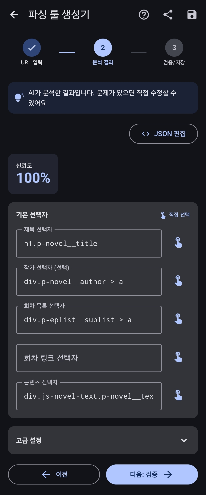
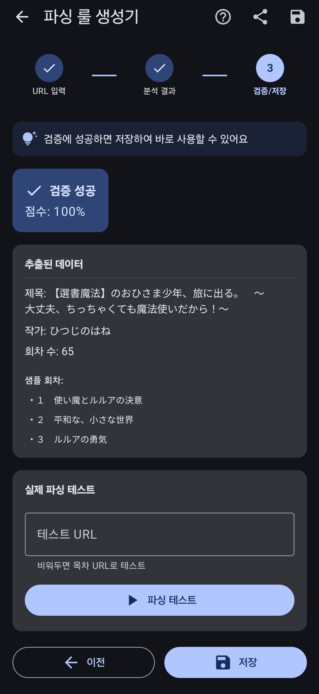

# Step 2. 파싱 룰 만들기

> **파일이나 텍스트로 소설을 등록하려면?**
> EPUB/TXT 파일이나 텍스트 직접 입력으로 소설을 추가하는 경우에는 파싱 룰이 필요 없어요!
> 이 단계를 건너뛰고 바로 진행하세요:
> - [파일로 소설 추가 (EPUB/TXT)](../novel-management/add-novel-file.md)
> - [텍스트 직접 입력](../novel-management/add-novel-text.md)
>
> 추가한 뒤에는 [Step 4. 소설 읽고 번역하기](read-and-translate/)로 이동하세요.

새로운 소설 사이트를 Transy에서 사용하려면 **파싱 룰**이 필요해요.
"이 사이트에서 소설 정보를 어떻게 읽어올지"를 AI가 자동으로 분석해줄 거예요.

이번 튜토리얼에서는 일본 소설 사이트 **소설가가되자(小説家になろう)**를 예시로 해볼게요.

---

## 2-1. 소설 추가 화면 들어가기

앱 하단의 **라이브러리** 탭에서 **+ 버튼**을 눌러주세요.

---

## 2-2. 소설 URL 입력하기

소설 URL 입력란에 아래 주소를 넣어볼게요:

```
https://ncode.syosetu.com/n0977kx/
```

> **팁**: 이 소설이 어떤 건지 궁금하다면, 위 주소를 브라우저에서 직접 열어보세요!
> 소설 정보와 회차 목록이 나오는 페이지예요.

URL을 입력하면 아래처럼 **"사이트가 아직 지원되지 않아요"** 메시지가 나와요.
걱정 마세요, **룰 자동 생성하기** 버튼을 눌러서 만들면 돼요!



---

## 2-3. 파싱 룰 생성기 사용하기

**룰 자동 생성하기**를 누르면 파싱 룰 생성기가 열려요.



두 개의 URL을 입력해야 해요:

| 항목 | 입력할 URL | 설명 |
|------|-----------|------|
| **목차 페이지** | `https://ncode.syosetu.com/n0977kx/` | 소설 정보와 회차 목록이 있는 페이지 |
| **1화 페이지** | `https://ncode.syosetu.com/n0977kx/1/` | 실제 소설 본문이 있는 페이지 |

> **1화 URL 찾는 법**: 브라우저에서 목차 페이지를 열고, 1화를 클릭한 뒤 주소창의 URL을 복사하세요.

### 로그인이나 인증이 필요한 사이트라면?

어떤 사이트는 로그인, 성인 인증, 캡차 등이 필요할 수 있어요.
그런 경우 **수동 확인 필요**를 체크하세요. 분석 전에 브라우저에서 직접 확인할 수 있어요.

### 고급 설정 (선택사항)

**추가 설명** 칸에 AI에게 힌트를 줄 수 있어요. 예를 들어:

- "목록이 페이지네이션으로 되어 있어요 (1 2 3 4 5 > 형태)"
- "회차 목록이 테이블 형태로 되어 있어요"

복잡한 사이트일수록 설명을 추가하면 분석 정확도가 올라가요.

---

## 2-4. AI 분석 시작하기

**다음** 버튼을 누르면 AI가 사이트를 분석하기 시작해요.

> **주의**:
> - 분석에는 보통 30초~2분 정도 걸려요
> - API 호출이 발생하므로 크레딧이 소모돼요

---

## 2-5. 분석 결과 확인하기

분석이 끝나면 결과 화면이 나와요.



**신뢰도**를 확인하세요:
- **90% 이상**: 분석이 잘 됐어요! **다음: 검증** 버튼을 눌러주세요.
- **90% 미만**: 고급 설정에서 설명을 추가하고 다시 시도해보세요.

---

## 2-6. 검증하고 저장하기

검증이 성공하면 아래와 같은 화면이 나와요.



꼭 확인할 것들:
- **회차 수**가 실제 소설의 회차 수와 맞는지
- **샘플 회차** 데이터가 제대로 추출됐는지

> **파싱 테스트**는 같은 사이트의 다른 소설로 테스트해보고 싶을 때만 사용하세요.

문제없다면 **저장** 버튼을 눌러주세요!

---

파싱 룰이 저장됐어요! 이제 이 사이트의 소설을 자유롭게 가져올 수 있어요.

[다음: 소설 가져오기 →](../import-novel/)
