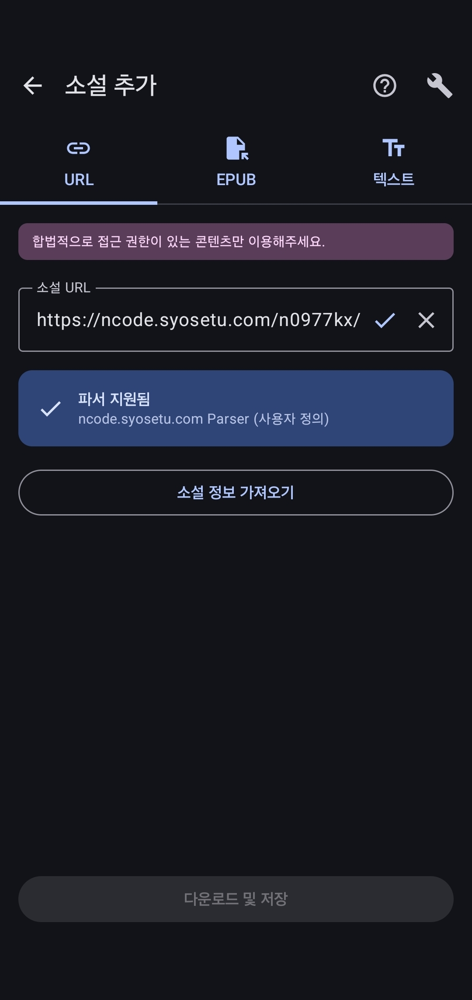
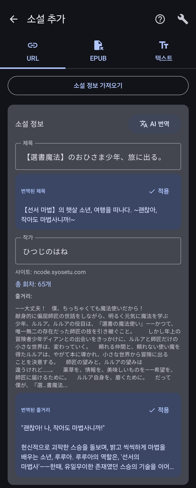

# Step 3. 소설 가져오기

드디어 마지막 단계예요!
파싱 룰을 만들었으니, 이제 소설을 가져와볼게요.

> **파일이나 텍스트로 소설을 등록하려면?**
> URL 대신 파일(EPUB/TXT)이나 텍스트 직접 입력으로도 소설을 추가할 수 있어요:
> - [파일로 소설 추가 (EPUB/TXT)](../novel-management/add-novel-file.md)
> - [텍스트 직접 입력](../novel-management/add-novel-text.md)

---

## 3-1. 소설 추가 화면으로 돌아가기

다시 **라이브러리 → + 버튼**을 눌러서 소설 추가 화면으로 들어가세요.

아까와 같은 URL을 입력해볼게요:

```
https://ncode.syosetu.com/n0977kx/
```

이번에는 **"파서 지원됨"**이라고 표시돼요!
파싱 룰이 잘 등록된 거예요.



**파서 지원됨** 버튼을 눌러주세요.

---

## 3-2. 소설 정보 확인하기

버튼을 누르면 소설 정보를 자동으로 가져와요.



가져온 정보를 확인하세요:
- 소설 제목
- 작가 이름
- 소설 설명

### 원본 그대로 저장하기

일본어 그대로 저장하고 싶다면 바로 **다운로드 및 저장**을 누르세요.

### 번역해서 저장하기

한국어로 번역된 제목과 설명으로 저장하고 싶다면:

1. **AI 번역** 버튼을 눌러주세요
2. 번역 결과가 나타나면 내용을 확인하세요
3. 마음에 들면 **적용 (체크 버튼)**을 눌러주세요
4. **다운로드 및 저장**을 눌러주세요

---

## 완료!

축하해요! 첫 번째 소설을 성공적으로 등록했어요.

이제 라이브러리에서 소설을 확인하고, 회차를 다운로드해서 읽을 수 있어요.

---

## 다음은?

- 다른 소설 사이트도 같은 방법으로 파싱 룰을 만들 수 있어요
- 한 번 만든 파싱 룰은 같은 사이트의 모든 소설에 적용돼요
- 설정에서 자동 번역, 다운로드 옵션 등을 조절할 수 있어요

이제 소설을 열어서 번역해볼까요?

[다음: 소설 읽고 번역하기 →](../read-and-translate/)

[← 튜토리얼 처음으로](../)
