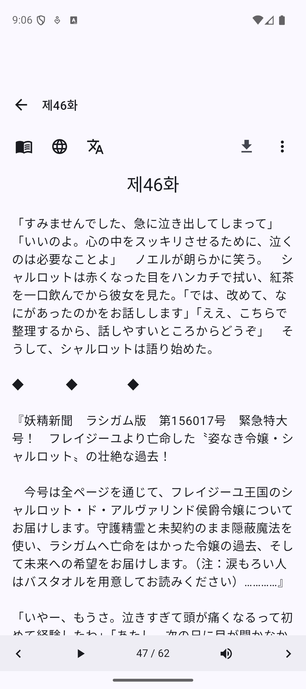
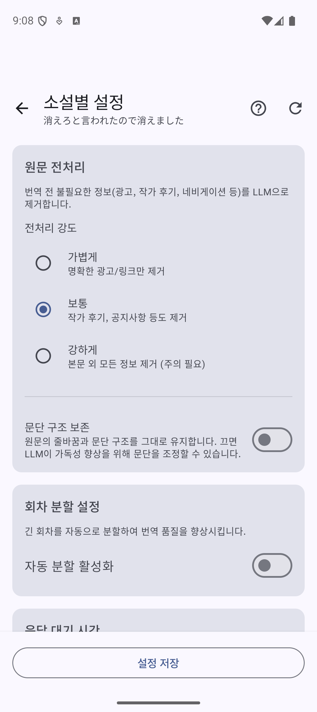
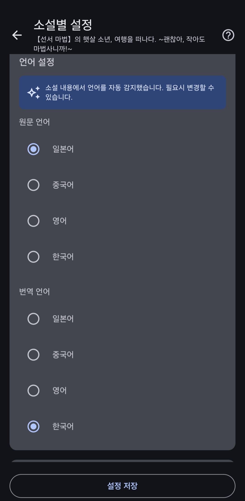
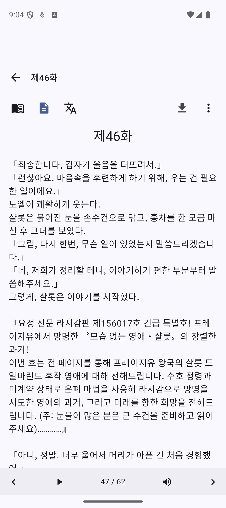

# Step 4. 소설 읽고 번역하기

소설을 가져왔으니 이제 읽어볼 차례예요!
처음 번역하는 방법을 차근차근 알려드릴게요.

---

## 4-1. 회차 목록 확인하기

소설을 가져오면 이런 화면이 보여요.

- **소설 정보**: 제목, 작가, 줄거리를 확인할 수 있어요
- **전체 회차**: 총 몇 화인지, 다운로드된 회차 수, 진행률을 볼 수 있어요
- **이어읽기**: 마지막으로 읽던 회차부터 이어서 읽어요
- **회차 목록**: 원하는 회차를 직접 선택할 수도 있어요

---

## 4-2. 회차 선택해서 열기

**이어읽기** 버튼을 누르거나, 회차 목록에서 읽고 싶은 회차를 선택하세요.

처음이라면 **1화**를 눌러볼게요.

---

## 4-3. 원문 확인하기

회차를 열면 아직 번역되지 않은 원문이 보여요.

일본어 원문이 그대로 표시되네요. 이제 번역을 해볼게요!

상단의 **文A 아이콘**(번역 버튼)을 눌러주세요.

---

## 4-4. 소설별 설정 확인하기

처음 번역할 때는 소설별 설정 화면이 나타나요.

**"첫 번역 전 소설 설정을 확인해주세요"** 라는 안내가 보이죠?

설정을 저장하지 않고 닫으면 번역이 시작되지 않으니 주의하세요!

여기서는 번역 품질을 높이는 데 도움이 되는 옵션만 소개할게요.

### 문단 구조 보존

원문을 봤을 때 줄 간격이 마음에 안 들거나, 문장이 다닥다닥 붙어있다면 이 옵션을 **끄세요**.

끄면 AI가 문단 구조를 적절하게 조정해서 가독성을 높여줘요.

### 자동 분할 활성화

소설 회차의 글자 수가 매우 길 경우(5천 자 이상) **켜는 것을 추천**해요.

- 자동으로 5천 자 미만으로 나눠서 번역해요
- 모델에 따라 2만 자 이상도 가능하지만, 번역 시간이 길어져요
- 너무 긴 회차는 분할하는 게 안정적이에요

---

## 4-5. 언어 설정 확인하기

아래로 스크롤하면 언어 설정이 있어요.

**"소설 내용에서 언어를 자동 감지했습니다"** 라고 나오지만, 간혹 오류가 있을 수 있어요.

- **원문 언어**: 소설의 원래 언어 (예: 일본어)
- **번역 언어**: 번역될 언어 (예: 한국어)

맞는지 확인하고, 틀리면 수정해주세요.

---

## 4-6. 번역 프롬프트 안내

번역 프롬프트(번역 지침)는 다른 AI 번역 툴과 비슷하지만, **소설 번역에 필요한 핵심 프롬프트가 이미 포함**되어 있어요.

특별히 원하는 뉘앙스나 분위기가 있다면 그 정도만 추가로 입력하세요.

> **팁**: 기본 설정만으로도 충분히 좋은 품질의 번역이 나와요!

---

## 4-7. 설정 저장하고 번역 시작하기

다른 설정들은 오른쪽 상단의 **? 아이콘**을 눌러 도움말을 확인하면서 자유롭게 조정하세요.

설정을 다 했으면 하단의 **설정 저장** 버튼을 눌러주세요.

이제 번역되지 않은 회차에서 다시 **번역 버튼(문A 아이콘)**을 누르면 번역이 시작돼요!

---

## 4-8. 번역 진행 확인하기

번역 버튼을 누르면 상단에 번역 진행 상태가 표시돼요.

- **토큰 수**: 번역에 사용된 토큰
- **소요 시간**: 번역에 걸린 시간
- **진행률 바**: 현재 번역 진행 상황

### 미리 받기 현황

여러 회차를 미리 번역해두는 기능도 있어요.

뷰어 화면 하단에 **프리패치 아이콘**(빨간색 배지)이 표시돼요:
- 아이콘을 탭하면 프리패치 상태 시트가 열려요
- 회차별 번역 진행 상태(대기/진행중/완료)를 확인할 수 있어요
- 현재 번역 중인 회차의 실시간 진행률도 볼 수 있어요
- 다음 회차로 넘어가면 자동으로 그 다음 회차가 큐에 추가되어 번역돼요

---

## 4-9. 번역 결과 확인하기

번역이 완료되면 자동으로 번역된 내용이 표시돼요!

일본어 원문이 한국어로 깔끔하게 번역되었네요.

---

## 완료!

축하해요! 첫 번째 번역을 성공적으로 마쳤어요.

이제 미리 받기로 다음 회차들도 자동으로 번역해두고, 편하게 소설을 감상하세요!

---

## 다음은?

- **미리 받기 설정**: 설정 탭의 "번역 설정"에서 미리 받을 회차 수를 조절할 수 있어요
  - 설정한 회차 수만큼 자동으로 미리 번역돼요
  - 회차를 읽을 때마다 자동으로 다음 회차가 큐에 추가돼요
- **API 모델 변경**: API 관리에서 모델을 **Gemini 2.5 Flash**로 설정하면 빠르고 품질 좋은 번역을 받을 수 있어요
- **용어집**: 자주 나오는 단어의 번역을 통일하고 싶다면 용어집을 활용해보세요
- **다른 소설**: 같은 방법으로 다른 소설도 번역할 수 있어요

즐거운 독서 되세요!

[← 튜토리얼 처음으로](../)
